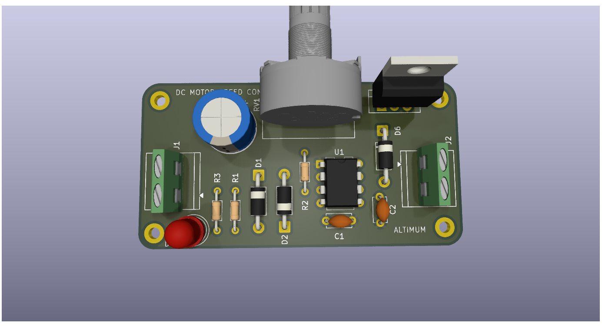
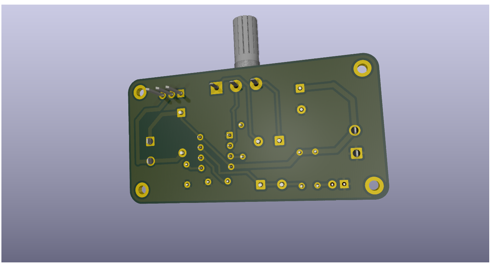

# DC MOTOR SPEED CONTROLLER PCB Design using KICAD -ALTIMUM
## PCB TOP VIEW

## PCB BOTTOM VIEW

## Project Overview🔧
The DC motor speed controller schematic is designed to vary the speed of a DC motor by controlling the voltage delivered to it using a PWM-based control circuit. The power supply is connected through the screw terminal connector J1, which provides the input DC voltage for the circuit. A decoupling capacitor such as C1 is placed across the supply lines to filter noise and stabilize the input voltage. The main control element of the circuit is the timer IC U1 (commonly configured as a 555 timer in astable mode), which generates a pulse width modulated (PWM) signal. The timing components R1, R2, and C2 determine the oscillation frequency of the timer, while the variable resistor RV1 allows the duty cycle of the PWM signal to be adjusted. By rotating the potentiometer RV1, the duty cycle changes, which directly controls the average voltage supplied to the motor and hence its speed.

The diodes D1 and D2 are used in the timing network to create separate charging and discharging paths for the capacitor C2, enabling smooth adjustment of the PWM duty cycle without significantly affecting the frequency. Additional capacitors such as C3 help stabilize the control voltage and reduce noise in the circuit. The PWM output from U1 drives the switching device Q1, which acts as the power stage that actually controls the current flowing to the DC motor. This transistor (or MOSFET) works as an electronic switch that rapidly turns the motor supply on and off according to the PWM signal. The motor is connected through another screw terminal J2, allowing easy external connection. A protection diode D4 is placed across the motor terminals to suppress back electromotive force (back-EMF) generated when the motor switches off, thereby protecting the transistor from voltage spikes. Additional diodes such as D6 may also be included for polarity protection or signal shaping depending on the design.

Overall, the circuit works by generating a variable PWM signal using the timer IC, controlling a transistor switch that regulates the power delivered to the motor. Adjusting the potentiometer changes the duty cycle of the PWM signal, which changes the effective voltage across the motor and thereby controls its speed efficiently. This project represents my attempt at learning PCB design using KiCad, where I explored schematic creation, component selection, and the basic design principles involved in building a practical DC motor speed controller circuit.
